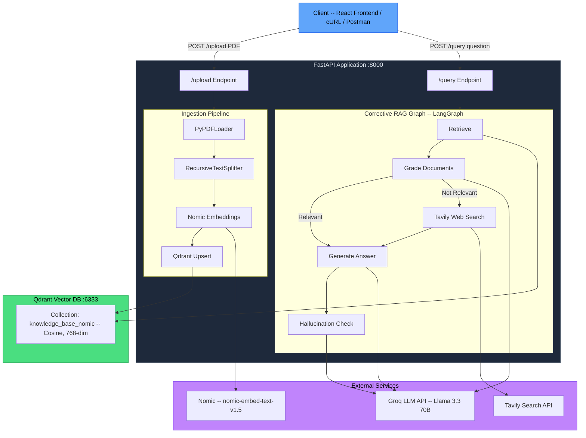
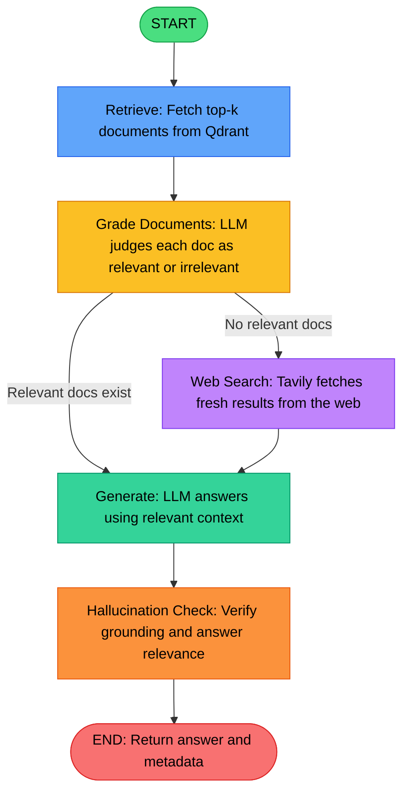

# Knowledge Base

A **production-grade Corrective Retrieval-Augmented Generation** system built with a **React/Vite Frontend**, **FastAPI**, **LangGraph**, **Qdrant**, and **Groq**. Upload PDFs, ask questions, and receive grounded, hallucination-checked answers with automatic web-search fallback when local documents fall short.

## Demo

<video src="C:\Users\talibul haque\Downloads\Screen Recording - Apr 3, 2026 (1).mp4" controls="controls" muted="muted" width="100%">
  Your browser does not support the video tag.
</video>

---

## Table of Contents

- [Key Features](#key-features)
- [Architecture](#architecture)
- [Tech Stack](#tech-stack)
- [Project Structure](#project-structure)
- [Prerequisites](#prerequisites)
- [Setup and Installation](#setup-and-installation)
- [Configuration](#configuration)
- [API Reference](#api-reference)
- [How It Works — The Corrective RAG Pipeline](#how-it-works--the-corrective-rag-pipeline)
- [License](#license)

---

## Key Features

| Feature | Description |
|---|---|
| **PDF Ingestion** | Upload any PDF — it is chunked, embedded, and stored in Qdrant automatically. |
| **Corrective RAG Workflow** | A LangGraph state-machine grades retrieved documents, falls back to web search when needed, and checks for hallucinations before returning an answer. |
| **Hallucination Guard** | Every generated answer is verified for factual grounding **and** question relevance. |
| **Web Search Fallback** | When local documents aren't relevant enough, Tavily web search seamlessly fills the gap. |
| **Production Docker Setup** | One-command deployment with Docker Compose — Qdrant + FastAPI, health-checked and ready. |
| **Fully Configurable** | All settings (model, temperature, embedding model, top-k, etc.) are driven from a single `.env` file. |
| **Interactive Frontend** | A modern, responsive React + Vite + Tailwind CSS frontend for seamless interaction. |

---

## Architecture

### High-Level System Diagram



### Corrective RAG — LangGraph Workflow



### Workflow Step-by-Step

| Step | Node | What Happens |
|------|------|-------------|
| 1 | **Retrieve** | The user's question is embedded and the top-k most similar chunks are fetched from Qdrant. |
| 2 | **Grade Documents** | Each retrieved document is graded by the LLM for relevance to the question (yes / no). |
| 3 | **Decide** | If relevant docs found, proceed to **Generate**. If none, fall back to **Web Search**. |
| 4 | **Web Search** (conditional) | Tavily searches the web for the question, returning up to 3 results as surrogate documents. |
| 5 | **Generate** | The LLM generates a concise answer grounded in the (filtered or web-sourced) context. |
| 6 | **Hallucination Check** | Two checks run: (a) Is the answer grounded in the provided facts? (b) Does it actually address the question? Result is `passed`, `failed_grounding`, or `failed_relevance`. |

---

## Tech Stack

| Layer | Technology | Purpose |
|-------|-----------|---------|
| **Frontend** | React 19 + Vite | Interactive upload and chat interface |
| **API Framework** | FastAPI 0.115 | Async REST API with automatic OpenAPI docs |
| **Orchestration** | LangGraph 0.4+ | Stateful, graph-based RAG workflow |
| **LLM** | Groq (Llama 3.3 70B Versatile) | Ultra-fast inference for grading and generation |
| **Embeddings** | Nomic `nomic-embed-text-v1.5` | High-performance 768-dim sentence embeddings |
| **Vector Store** | Qdrant | High-performance vector similarity search |
| **Web Search** | Tavily API | Real-time web search fallback |
| **PDF Parsing** | PyPDF | Robust PDF text extraction |
| **Config** | Pydantic Settings + `.env` | Type-safe, validated configuration |
| **Containerization** | Docker + Docker Compose | One-command reproducible deployment |

---

## Project Structure

```
Knowledge_Base/
│
├── frontend/                     # React/Vite Frontend
├── app/                          # Application source code
│   ├── main.py                   # FastAPI app — routes and middleware
│   ├── config.py                 # Pydantic Settings (reads .env)
│   ├── models.py                 # Request/Response Pydantic models
│   ├── ingestion.py              # PDF loading, chunking, embedding and Qdrant upsert
│   ├── retrieval.py              # Vector store retriever factory
│   ├── graph.py                  # LangGraph Corrective RAG state machine
│   └── prompts.py                # All LLM prompt templates
│
├── uploads/                      # Runtime directory for uploaded PDFs
├── .env                          # Environment variables (API keys, config)
├── .gitignore                    # Git ignore rules
├── requirements.txt              # Python dependencies
├── Dockerfile                    # App container image
├── docker-compose.yml            # Multi-service orchestration (App + Qdrant)
└── README.md                     # You are here
```

---

## Prerequisites

Before you begin, make sure you have the following:

| Requirement | Version | Notes |
|---|---|---|
| **Docker and Docker Compose** | 20.x+ / 2.x+ | Required to run the app |
| **Groq API Key** | — | Sign up at [console.groq.com](https://console.groq.com) |
| **Tavily API Key** | — | Sign up at [tavily.com](https://tavily.com) |
| **Git** | 2.x+ | To clone the repository |

---

## Setup and Installation

Docker Compose starts both the **FastAPI app** and the **Qdrant database** with a single command.

### 1. Clone the Repository

```bash
git clone https://github.com/TkWarrior/Knowledge_Base.git
cd Knowledge_Base
```

### 2. Configure Environment Variables

Create a `.env` file in the project root (or edit the existing one):

```dotenv
# LLM and Search
GROQ_API_KEY=gsk_your_groq_api_key_here
TAVILY_API_KEY=tvly-your_tavily_api_key_here
NOMIC_API_KEY=nk-your_nomic_api_key_here

# Qdrant
QDRANT_HOST=localhost
QDRANT_PORT=6333

# Collection and Embeddings
COLLECTION_NAME=knowledge_base_nomic
EMBEDDING_MODEL=nomic-embed-text-v1.5

# LLM Settings
LLM_MODEL=llama-3.3-70b-versatile
LLM_TEMPERATURE=0.0

# Retrieval
TOP_K=5

# Uploads
UPLOAD_DIR=uploads
```

> **Warning:** Never commit your real API keys. The `.env` file is already in `.gitignore`.

### 3. Build and Start

```bash
docker compose up --build -d
```

This will:
1. Pull the `qdrant/qdrant:latest` image.
2. Build the FastAPI app image from the `Dockerfile`.
3. Start Qdrant on ports **6333** (HTTP) and **6334** (gRPC).
4. Wait for Qdrant's health check to pass, then start the app on port **8000**.

### 4. Verify

```bash
# Check all containers are running
docker compose ps

# Hit the health endpoint
curl http://localhost:8000/health
```

Expected response:

```json
{"status": "healthy", "service": "corrective-rag"}
```

### 5. Open the Docs

Navigate to [http://localhost:8000/docs](http://localhost:8000/docs) for the interactive Swagger UI.

### 6. Stop

```bash
docker compose down          # Stop containers (data persists in volumes)
docker compose down -v       # Stop containers AND delete vector data
```

---

## Configuration

All configuration is managed through environment variables loaded via **Pydantic Settings**. Place these in the `.env` file at the project root.

| Variable | Default | Description |
|---|---|---|
| `GROQ_API_KEY` | (required) | API key for Groq LLM inference |
| `TAVILY_API_KEY` | (required) | API key for Tavily web search fallback |
| `NOMIC_API_KEY` | (required) | API key for Nomic embedding model |
| `QDRANT_HOST` | `localhost` | Hostname of the Qdrant instance |
| `QDRANT_PORT` | `6333` | HTTP port for Qdrant |
| `COLLECTION_NAME` | `knowledge_base_nomic` | Qdrant collection to store document vectors |
| `EMBEDDING_MODEL` | `nomic-embed-text-v1.5` | Nomic sentence-transformer model name |
| `LLM_MODEL` | `llama-3.3-70b-versatile` | Groq model identifier |
| `LLM_TEMPERATURE` | `0.0` | Temperature for LLM generation (0 = deterministic) |
| `TOP_K` | `5` | Default number of documents to retrieve |
| `UPLOAD_DIR` | `uploads` | Directory for storing uploaded PDFs |

---

## API Reference

The API exposes 4 endpoints. Full interactive documentation is available at `/docs` (Swagger UI) and `/redoc` (ReDoc) when the server is running.

### GET /health

Health check endpoint.

**Response:**

```json
{ "status": "healthy", "service": "corrective-rag" }
```

---

### POST /upload

Upload and ingest a PDF file into the vector database.

**Request:** `multipart/form-data` with a `file` field (PDF only).

```bash
curl -X POST http://localhost:8000/upload \
  -F "file=@/path/to/your/document.pdf"
```

**Response:**

```json
{
  "message": "PDF ingested successfully",
  "filename": "document.pdf",
  "chunks_ingested": 42,
  "collection": "knowledge_base_nomic"
}
```

---

### POST /query

Ask a question against the ingested knowledge base.

**Request Body:**

```json
{
  "question": "What are the key findings of the paper?",
  "top_k": 5
}
```

| Field | Type | Required | Description |
|---|---|---|---|
| `question` | string | Yes | The question to ask |
| `top_k` | int | No | Number of documents to retrieve (1-20, default: 5) |

```bash
curl -X POST http://localhost:8000/query \
  -H "Content-Type: application/json" \
  -d '{"question": "What is the main contribution of this paper?", "top_k": 5}'
```

**Response:**

```json
{
  "answer": "The main contribution is ...",
  "sources": [
    {
      "content": "Excerpt from the document ...",
      "source": "document.pdf",
      "page": 3,
      "relevance_score": ""
    }
  ],
  "web_search_used": false,
  "hallucination_check": "passed"
}
```

| Field | Description |
|---|---|
| `answer` | The generated answer |
| `sources` | List of source documents used (content truncated to 500 chars) |
| `web_search_used` | `true` if Tavily web search was triggered |
| `hallucination_check` | `passed`, `failed_grounding`, or `failed_relevance` |

---

### GET /collections

List all Qdrant collections and their stats.

```bash
curl http://localhost:8000/collections
```

**Response:**

```json
{
  "collections": [
    {
      "name": "knowledge_base_nomic",
      "vectors_count": 42,
      "points_count": 42
    }
  ]
}
```

---

## How It Works — The Corrective RAG Pipeline

Traditional RAG retrieves documents and passes them directly to an LLM. **Corrective RAG** adds self-reflection layers that dramatically improve answer quality:

1. **Retrieve** — Embed the question and fetch top-k similar chunks from Qdrant using cosine similarity.

2. **Grade** — The LLM evaluates each retrieved document: "Is this document relevant to the question?". Irrelevant documents are filtered out, reducing noise in context.

3. **Decide** — If relevant documents remain, proceed to generation. If all documents were filtered out, the system falls back to **web search**.

4. **Web Search** (fallback) — Tavily API searches the web for the query, returning up to 3 fresh results that serve as surrogate context.

5. **Generate** — The LLM produces an answer grounded in the filtered (or web-sourced) context.

6. **Hallucination Check** — Two final verification passes:
   - **Grounding check** — Is the answer actually supported by the provided documents?
   - **Relevance check** — Does the answer address the original question?

   The result is returned as part of the response so the client can act on it.

---

## License

This project is open-source. Feel free to use, modify, and distribute as needed.

---

<p align="center">
  Built with React, FastAPI, LangGraph, Qdrant, and Groq
</p>
